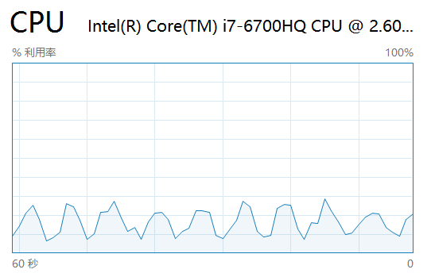
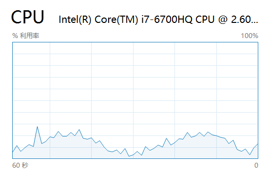
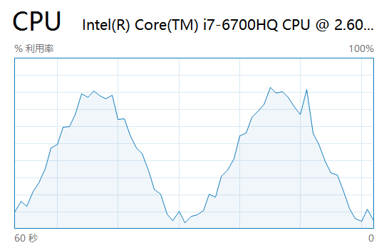

# 用一张网页让 CPU 使用率曲线呈三角函数图像

如果你在一个页面中用 JS 写个死循环，然后打开网页，你会发现页面将会**卡死**。

如果这时你打开任务管理器，你会发现这个页面占去了你一个 CPU 的内核的计算能力，即：如果你的 CPU 是 8 核的，那这个页面将占去 12.5% 左右的 CPU 使用率，如果是单核，则 CPU 将是满负荷运转（后文中如无特殊注明，暂时只考虑单核 CPU）。

JS 能让 CPU 满负荷，那么理论上当然也能让 CPU 以任何负荷运转了，如果真的能这样，那么理论上用 JS 也可以实现《编程之美》那本书里的第一个问题：让 CPU 占用率曲线呈正弦曲线。

那么我们先来看一下 Windows 任务管理器中 CPU 曲线的变化规律：通过观察可以发现，CPU 使用率曲线大概是每秒更新一次，如果让电脑静默，那么 CPU 曲线的波动不会太大，而如果动一下鼠标或者执行一下切换窗口等操作，就会发现曲线升高。如果在某段时间内，CPU 一直在执行代码（比如说死循环），则 CPU 的占用率就是满的（对于八核 CPU 来说，使用率就是 12.5%）。而曲线是按秒更新，所以我们大致可以猜测，上一个一秒内，CPU 执行代码的时间占比就是 CPU 的占用率。

所以如果能够随时间的变化让 CPU 在每秒钟内执行代码的时间也发生变化就可以达到控制 CPU 使用率曲线的目的。

那么问题来了，死循环可以让 CPU 满负荷运转，可是在某一秒内让 CPU 使用率只占一半或其它值要怎么做呢？

你可能会想，JS 这种网页脚本语言，怎么会有控制 CPU 的功能呢？

当然没有了。

## 换个思路

但是你有没有想过，**JS（或者任何其它语言）在运行的时候，其实就是在使用/控制 CPU 嘛。**要想让 CPU 使用率为 50%，我们只要在一秒内让 CPU 执行代码的时间为半秒就可以了。想要让 CPU 的使用率为其它值也可以依次类推。

可是 CPU 使用率曲线是每秒更新，想要画出曲线，必然就要在**每秒内**都改变 CPU 执行代码的时间。在 JS 里要怎么才能做到每秒内让 CPU 执行代码的时间不一样呢？

那必然是**每秒钟都得执行 JS 代码**啊，而且还需要这段代码**在不同的秒内执行时间不一样**才可以。

说到每秒钟执行 JS，了解 JS 的同学肯定一下就能想到用 `setTimeout` 或者 `setInterval` 了。

剩下的就是让我们的代码在每秒中内执行的时间不一样就可以了，可是这要怎么做呢？

如果写了死循环，那代码就会一直执行下去，如果不写死循环，那代码可能在一毫秒内就执行完了，如何才能控制代码执行的时间呢？

其实这并没有想象中那样不可能，我们还是可以写死循环嘛，然后在合适的时间把循环 break 掉就可以了：**记录死循环开始的时间，然后在循环体里判断循环执行多久了，到了我们需要的时长 break 就行了。**

最终，我们得出如下思路：

用 setInterval 每隔一秒执行一段代码，**这段代码在每秒内的内执行时长与其执行的时刻有关**，关系就是我们指定的函数，这样一来 CPU 的使用率曲线就是我们所指定的函数的图象了。

但事情没有这么简单，因为 CPU 使用率只能大于等于 0，而如果我们选择 sin(t) 做为函数关系的话，将只能画出其在** x 轴上方**部分的图象，这个好办，我们把 sin(t) 的图象做一下变换就可以了，如果我们使用 `f(t) = (sin(t) + 1) / 2` 这个函数（向上移动 1 个单位并把高度压缩为原来的一半）的话，图象在 y 轴的范围就是 0 到 1 了，正好可以让我们拿来做百分比用。

于是我们写出了这样的代码：

```js
var second = 0

//想要绘制的函数
var f = function(t) {
  return (Math.sin(t) + 1) / 2
}

//此函数每秒执行一次
//内部主要耗时的是一个死循环
//其执行时长跟其执行的时刻及上面定义的函数的返回值有关
setInterval(function(){
  var percent = f(second++)//想要看到的 CPU 占用率
  var duration = percent * 1000//死循环需要执行的时间
  var start = Date.now()//记录下面死循环开始的时间
  for(;;) {
    if (Date.now() - start > duration) {//如果已经执行超过duration的时长了，就退出
      break
    }
  }
}, 1000)
```

然后我们打开页面，再打开任务管理器，你会发现 CPU 的曲线大概是这样的：



基本上已经成型了，可是为毛有点丑呢？而且图像一点也不平滑。

## 让图像更平滑

首先来解释一下图像不够平滑的原因，一方面，**CPU 并不是只被我们的 JS 使用**，系统中其它的程序也在使用，所以在有些地方会显得跳跃比较大，因为占用率是**我们的程序的的占用率加上其它程序的占用率之和。**这个好办，我们把系统中其它的程序尽量关闭就可以了。

然而**即使你把系统中其它的程序都关掉，也还是会发现图像不够平滑**，原因是什么呢？

即使关闭所有不相关的程序，CPU 也还是会被系统使用，不过系统大部分时候处于闲置状态。那么抛开操作系统较低的占用率，图像为什么还是不平滑呢？

观察一会儿我们就会发现，CPU 的占用率曲线是**每秒更新**，而我们的函数的周期是 2pi，反映到图像里就是 6.28 秒，而图像的取样是每秒进行一次，所以**在一个周期内，最多只能取到 6 个点**，而任务管理器是使用折线图绘制的图像，仔细观察会发现占用率图像确实是折线图。

## 增大图像周期

知道了原因，就好解决了，我们**既然不能改变取样频率，那只能改变我们函数的周期了**，把函数周期变长一点就好了。为了便于观察，我们就让函数的周期为 30（秒）好了，这样一个周期就能取 30 个点。于是我们把函数的公式改为 `(Math.sin(t / 4.77) + 1) / 2`，4.77 这个系数是拿 30 除以 2pi 得出来的，这是高中数学，就不在这里详述了。

然后我们刷新页面再看任务管理器，大概会看到下面这样的曲线：



因为我并没有关闭系统中其它的程序，所以曲线上还是有很多毛刺，但可以清晰的看到，我们把图像的周期拉长了。我的 CPU 是 8 核，所以图像最高点应该是在 12.5% 左右的位置，从图像中可以看到，最高点没有超过 25%，但是超过 12.5% 还是蛮多的，因为系统中其它程序的 CPU 占用率也算进来了。对于单核 CPU 的系统来说，这个图像的最高点应该是接近 100% 的。

于是问题又来了，在不关闭系统中其它程序的情况下，如何让图像显得尽量平滑些呢？

JS 肯定没有办法获取系统中其它程序对 CPU 的总占用量，我们只能想其它办法了。

## 增加图像高度

考虑到在不与系统中其它程序交互的时候，**它们对 CPU 的占用都比较小，要想让它们对图像的影响减小，那只能让图像的高度增加了，这样一点小的影响在更高的图像上就显得不那么明显了。**

现在的 CPU 大都是多核的，而我们最多只能占用一个核的计算能力，如果能够把所有核的计算能力都用上，那么其它程序占用的 CPU 呈现到图像上就不那么明显了。

可是如何才能让我们的程序占用其它内核的计算能力呢？**即使写死循环，也只能把一个核跑满。**

一个简单粗暴的方法是**开多个页面**，这样相当于开启了多个进程，每个进程占用一个内核，如果所有的页面对其所使用的内核占用率是同步的话，那么图像就会变的比较高。但这个方法总感觉有点粗暴。

**如果能在一个页面里就把所有的 CPU 内核都占了就好了。**

另一个简单粗暴的办法是：用多个 iframe 嘛。这个方案确实可以，但跟前一种开多个页面的方案没有什么本质区别。

有没有更好的方案呢？

## 使用多线程

其实要占用一个 CPU 内核，完全不需要一个**进程**，只需要一个**线程**就足够了。

在浏览器里如何开启一个线程呢 ？

JS 中没有真正的多线程，但是熟悉新技术的同学肯定知道 Web Worker，它基本算是浏览器里使用多线程的 API 了。

Web Worker 与 UI 不在同一个线程，Worker 内的代码也不能访问 UI 线程内的几乎所有资源，只能通过 postMessage 和 onmessage 事件来异步的传递信息，**并且也不是按指针传递消息，而是把消息序列化后传递过去的**，这样就避免了真正的多线程中死锁等问题。目前一般的使用场景是把耗时的操作放进 Worker 里执行，比如模板的渲染等。

于是对于 8 核 CPU 来说，我们开 8 个 Worker 线程就可以了：

```html
<script>
  for(i of Array(8)) {
    new Worker('sin.js')
  }
</script>
```

而 sin.js 文件里就是我们前面的代码，截图如下：



[完整 Demo 在这里。](https://xieranmaya.github.io/blog/demo/cpu.html)

可是问题又来了，想要让这个图像在不同的电脑上都能显示的比较好，即图像最高点都是 100%，我们还需要知道 CPU 内核的数量，如何得到 CPU 内核的数量呢？

## 探测 CPU 内核数量

其实在现代浏览器中，可以通过 `navigator.hardwareConcurrency` 获取 CPU 内核的数量，但对于不支持这个特性的浏览器，如何只用 JS 就能得知 CPU 内核的数量呢？

其实通过本文的分析可以得知，每增加一个线程，我们程序的「性能」将会增加「一份」，而如果我们已经运行的线程数与 CPU 内核数量一样，再增加线程的话，我们程序的「性能」将不会继续**线性增加**，此时就可以大概确定 CPU 内核的数量，如果你照着这个思路去实现探测 CPU 内核数量的代码，其实你就是在对 CPU 做**时序攻击（Timing Attack）。**事实上，[这个特性确实是有 Polyfill 的](https://github.com/oftn-oswg/core-estimator)，就是使用的这种思路来探测 CPU 内核数量的，可以[点击这里查看它的 Demo](https://oswg.oftn.org/projects/core-estimator/demo/)。

此文为了通俗易懂，有不少概念表达的不够精准，还请各路大神轻喷。
